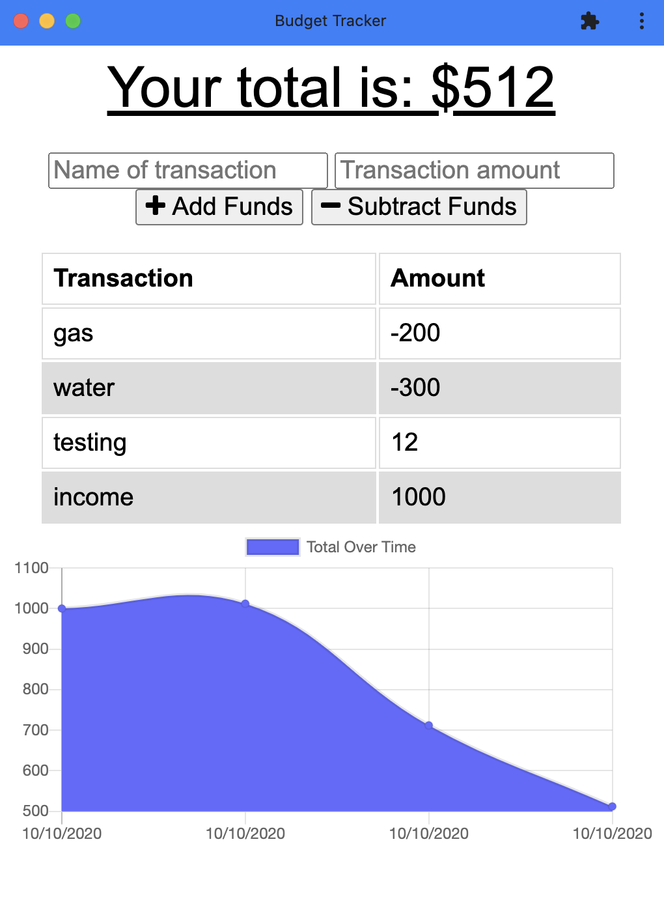

# Budget Tracker 

## Description

Workout Tracker that utilizes MongoDB database to track a user's daily exercises such as bench presses or running. Weekly workout stats are charted using Chart.js. 

Deployed Site: <https://pure-stream-40288.herokuapp.com/>

## Table of Contents

* [Installation](#installation)
* [Usage](#usage)
* [License](#license)

## Installation

clone this Repo. 

```
npm install
```

Visit the deployed page link.

## Usage



## License

Licensed under ISC License.

## Questions

Contact [mc4506](mailto:mike4506@gmail.com)